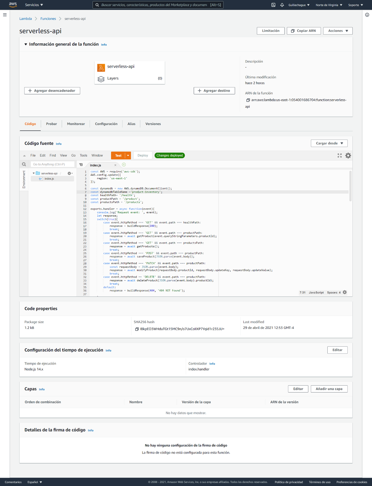
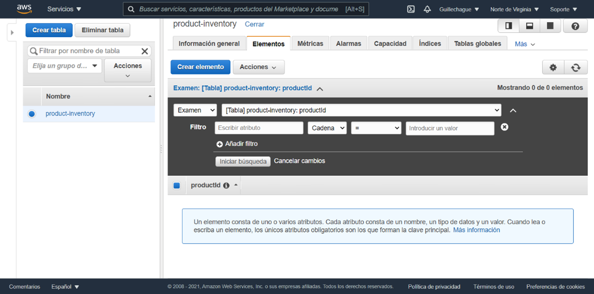
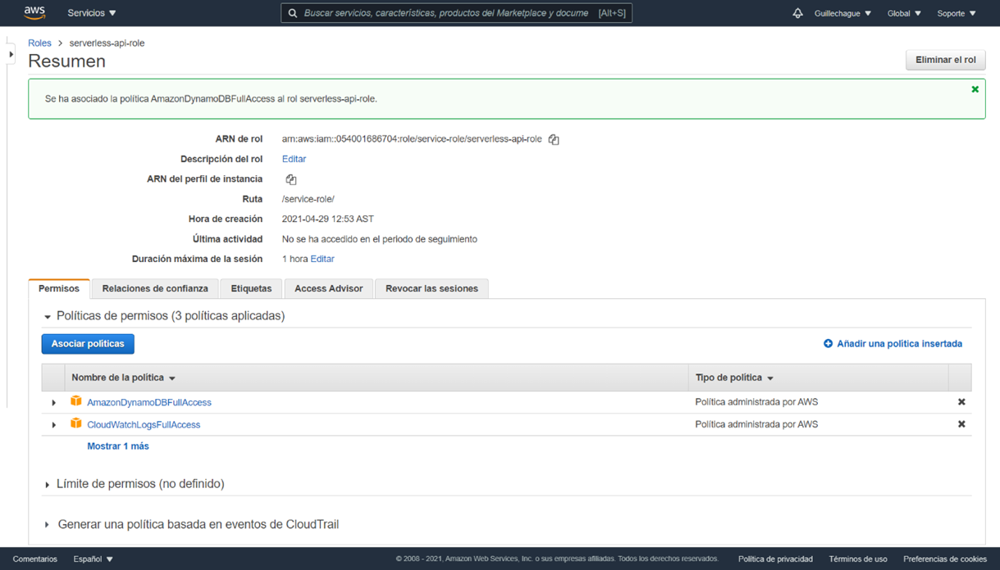
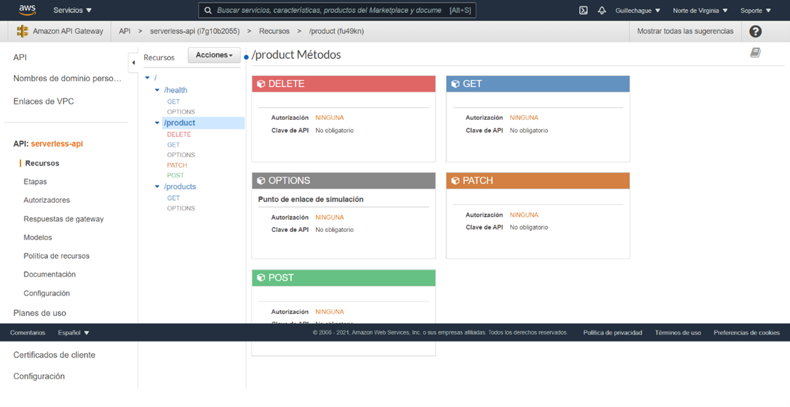

# Lambda - AWS

## Arquitectura Desarrollada

## Desarrollo en Lambda

### DynamoDB

### Reglas de IAM para serverless-api

### Desarrollo del API Gateway

### Petición POST al cliente por medio de Postman

